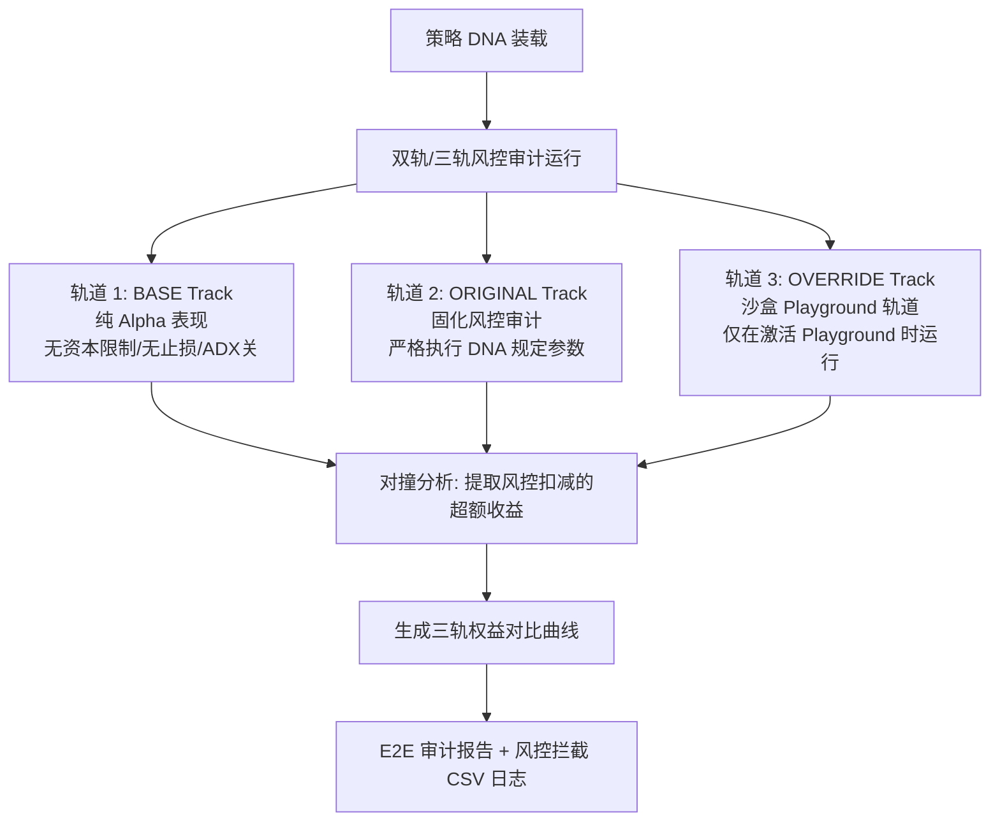

# 🛡️ 风控哨兵 - DNA 驱动的多轨风控审计使用指南

**风控哨兵 (Risk Sentinel)** 是量化平台固化交易逻辑与实盘线上风控之间的“终极安全过滤器”。通过自动装载回测归档的 **策略 DNA JSON 文件**，系统在“风控沙盒”中模拟真实资本约束与拦截规则，执行 **三轨对撞审计 (Triple-Track Audit)**，防止因过度拟合、杠杆过高或缺乏止损导致实盘毁灭性穿仓。

---

## 目录
1. [三轨风控审计工作流 (Triple-Track Audit)](#1-三轨风控审计工作流-triple-track-audit)
2. [输入面板参数详解](#2-输入面板参数详解)
    - [2.1 数据中心策略选择 (Select Strategy)](#21-数据中心策略选择-select-strategy)
    - [2.2 Alpha DNA (只读展示区)](#22-alpha-dna-只读展示区)
    - [2.3 风控沙盒调优 (Override Parameters - Playground)](#23-风控沙盒调优-override-parameters---playground)
3. [输出面板与 KPI 核心卡片解读](#3-输出面板与-kpi-核心卡片解读)
    - [3.1 📊 风控四大 KPI 卡片](#31--风控四大-kpi-卡片)
    - [3.2 权益曲线对比图 (Risk Audit Verification)](#32-权益曲线对比图-risk-audit-verification)
    - [3.3 多轨对比表格](#33-多轨对比表格)
4. [风控报告与审计日志异步导出](#4-风控报告与审计日志异步导出)

---

## 1. 三轨风控审计工作流 (Triple-Track Audit)

风控哨兵的核心特色在于其创新的 **三轨对撞审计机制**。当您载入策略 DNA 并点击 `Run Audit` 时，引擎会启动三条完全平行的虚拟交易跑道：

* **BASE Track (纯 Alpha 轨道)**：模拟无初始资本限制、无保证金约束、不带止损止盈、关闭 ADX 过滤的“裸 Alpha 表现”，用于诊断因子的纯净捕获能力。
* **ORIGINAL Track (固化风控轨道)**：严格执行由回测端在策略 DNA JSON 中固化的风控边界（杠杆、止损、最大仓位等）。
* **OVERRIDE Track (沙盒风控轨道)**：仅在勾选 `🎮 Enable Risk Override (Playground)` 后激活。允许风控员实时重设参数，在不破坏原始 DNA 的前提下模拟调优。

---

## 2. 输入面板参数详解

操作时请对照主窗口左侧风控配置面板：

### 2.1 数据中心策略选择 (Select Strategy)
* **Select Strategy from Data Center**：下拉框会自动扫描回测接力自动归档的目录 `datacenter/Backtest_data/`，列出所有已完成回测的策略名称。
* ** Refresh Data Center**：手动重新扫描数据中心。

---

### 2.2 Alpha DNA (只读展示区)
选定策略后，只读文本框中将高亮展示该策略在回测阶段锁定的**核心遗传因子 (DNA) 信息**：
* **ID (策略唯一标识)**：防篡改唯一哈希码。
* **Universe (交易资产包)**：策略作用的资产（如 `FCPO`）。
* **Timeframe (时间轴)**：行情周期粒度（如 `15m`）。
* **决策参数**：只读显示 `Entry Thresh` (入场轨)、`Exit Thresh` (出场轨)、`Exec Mode` (开盘还是收盘)、`Multiplier` (合约乘数)。
  
*设计宗旨：风控部门审计时，必须保证策略原始交易逻辑参数“不可更改”，以防研发人员作弊。*

---

### 2.3 风控沙盒调优 (Override Parameters - Playground)

若风控员希望测试“如果提高保证金”或“加入更严苛的止损”策略表现会如何，可勾选 **`🎮 Enable Risk Override (Playground)`** 激活沙盒面板：

| 沙盒调优参数 | 业务物理定义 | 调优审计思路 |
| :--- | :--- | :--- |
| **Initial Capital** | 风控重设的初始资金。 | 测试在资金量缩水（如回测 10w，实盘只给 5w）时，策略是否会因资金过小而爆仓。 |
| **Initial Margin** | 单手合约占用保证金。 | 模拟当马交所调高棕榈油保证金要求时，策略的承受上限。 |
| **Risk Target %** | 动态 ATR 单笔风险比例上限。 | 调小该值（如从 1% 降到 0.5%）可有效平抑持仓波动。 |
| **Max Lots** | 单次允许持有的最大合约手限额。 | 强行给高杠杆策略设置硬性天花板。 |
| **Stop Loss %** | 沙盒移动止损百分比 ($0.00\%$ 为不设)。 | 在原始 DNA 无止损时，强行插入移动止损线，测试对最大回撤的改善。 |
| **Take Profit %** | 沙盒移动止盈百分比。 | 强行插入止盈限制，测试是否能够“落袋为安”。 |
| **Leverage Limit** | 账户最大允许杠杆倍数限额（如 `10.00x`）。 | 当名义总市值超过总权益指定倍数时，拦截后续买单。 |
| **ADX Filter** | 是否启用 ADX Choppy 趋势强度过滤器。 | 强制策略在低波动猴市中休眠。 |
| **Allow Overnight** | 是否允许持仓过夜。 | 强制策略平仓过夜，测试对隔夜跳空 Gap 风险的对冲能力。 |

---

## 3. 输出面板与 KPI 核心卡片解读

分析完成后，右侧仪表盘会实时高亮显示风控审计结果：

### 3.1 📊 风控四大 KPI 卡片

风控控制台上方陈列了 4 张极富质感的机构级风控卡片，用于对 ORIGINAL 轨道的表现进行“水分抽干”：

1. **`CALMAR RATIO` (卡玛比率 - 绝对值指标)**：
   * **公式**：年化收益率 / 最大回撤(MtM)。
   * **风控诊断**：这是评估策略收益性价比的核心依据，若该数值较回测阶段大幅缩水，说明在严苛的止损/日内平仓下策略捕获能力较弱。
2. **`MAX DD DURATION` (最大回撤持续期)**：
   * **业务定义**：策略卡在亏损状态中无法创出权益新高的最长 Bar 数。
   * **心理警戒线**：持续时间过长的策略（如日内K线下持续 20 天未创新高）极易导致实盘交易员精神崩溃，风控员会据此进行降额。
3. **`RECOVERY FACTOR` (恢复因子)**：
   * **公式**：账户总净利润 / 最大回撤金额。
   * **风控诊断**：展示策略在遭遇毁灭性打击后，依靠其自身的 Alpha 修复能力“爬出深坑”的速度与幅度。数值 $> 3.0$ 表现优秀。
4. **`SIGNALS BLOCKED` (信号拦截指示器 - 支持点击下钻)**：
   * **核心机制**：**支持点击唤出明细对话框**！
   * **展示内容**：展示在 ORIGINAL 运行期间，有多少笔原始交易信号因为触犯了风控边界而被系统**强行拦截或等比例调低手数**。
   * **分析意义**：如果 Block 比例高达 `80%`，说明该策略的交易信号过于粗放，基本是靠强行风控拦截在勉强维持盈利，建议策略重构。

---

### 3.2 权益曲线对比图 (Risk Audit Verification)
* **技术实现**：由 PyQtGraph 多线程高性能渲染。
* **多线对撞解读**：
  * **`BASE 曲线` (通常在上方/宽幅剧烈震荡)**：展示若不施加任何约束策略能赚取的“理论暴利”，但其最大回撤和潜在爆仓风险也一览无余。
  * **`ORIGINAL 曲线` (平滑平缓)**：施加 DNA 风控后的表现。虽然净利润可能有所折损，但曲线的平滑度（最大回撤控制）会显著优化。
  * **`OVERRIDE 曲线` ( Playground 激活时显示)**：展示沙盒参数调试后的表现。通过对比 Original 与 Override，风控员可以清晰看出修改某项风控参数对曲线稳定性的实时改善。

---

### 3.3 多轨对比表格
* 位于图表下方，动态渲染 2 轨或 3 轨的全面对比数据矩阵。
* 精准列示 BASE ➔ ORIGINAL ➔ OVERRIDE 状态下，总收益率、日Sharpe、日最大回撤 %、保证金触发次数等指标的直接变动偏离值，为风控会议提供最科学的脱水决策依据。

---

## 4. 风控报告与审计日志异步导出

由于风控日志的导出涉及海量历史数据合并，为了防止软件前台界面“假死”或崩溃，系统在后台部署了 **异步线程导出器 (ExportWorker)**：

1. **`📋 Export End-to-End Report` (绿色按钮 - 核心业务输出)**：
   * 自动生成包含多轨收益偏离、风控拦截占比以及参数建议的**端到端管道完整审计报告**。
2. **`💾 Export Audit Log` (灰色按钮 - CSV 日志对齐)**：
   * **异步线程归档**：点击后，系统拉起后台异步线程，合并平仓交易日志与 Risk Interceptor 的风控拦截日志。
   * **输出对齐**：在指定的导出目录下自动生成 `BASE_trade_log.csv`、`ORIGINAL_trade_log.csv` 和 `OVERRIDE_trade_log.csv`，将 `平仓数据` 与 `风控拦截理由 (Type: Order_Approved/Reason)` 在行维度上进行 **1:1 物理对齐合并**，彻底解决研发与风控之间的数据不对齐痛点。
   * **存储路径**：数据自动归档至：
     `D:\personal\quant\Quant\-\datacenter\Risk_data\<策略名>_tradelog.csv`
