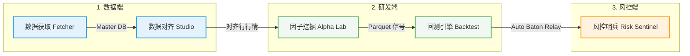

# 🛡️ Quant Data Bridge - 用户使用手册 (User Manual)

欢迎使用 **Quant Data Bridge** 量化交易研究与风控终端。本套手册专为量化开发人员与策略研究员设计，旨在提供从底层数据源获取、因子加工、策略回测到三轨风控哨兵审计的完整闭环操作指南。

---

## 🧭 四大核心业务工作流 (Core Workflows)

系统内部实现了无缝的 **数据与参数接力 (Baton Relay)**，各业务模块之间的衔接关系如下：

1. **`📥 数据抓取` 与 `⚖️ 数据对齐`**：获取不同市场的异构多周期行情，并通过“基准资产对齐”规整为时序对齐的高质量 Parquet 数据集，存储于本地 Master DB。
2. **`🔬 Alpha 研究`**：基于清洗后的行情数据，运用 Python 表达式快速合成 Alpha 因子。系统内置强大的 **AST 静态代码安全审计**，能够拦截前瞻偏差代码，保障信号的真实有效性。
3. **`🚀 回测引擎`**：读取生成的因子信号包，仿真模拟买卖交易。支持动态 ATR 仓位缩放、止损止盈、滑点与佣金压力测试。回测结束后，系统会自动进行 **Baton Relay（接力流）**：
   * 自动生成包含参数 MD5 与微秒级高精时间戳的 **策略 DNA JSON 文件**、**交易日志 CSV** 和 **权益曲线 CSV**；
   * 自动将其聚拢并安全归档至数据中心的 `datacenter/Backtest_data/` 目录中。
4. **`🛡️ 风险控制`**：风控哨兵通过自动载入策略 DNA，执行 **BASE（纯Alpha无风控）** vs **ORIGINAL（DNA风控）** vs **OVERRIDE（沙盒微调）** 的三轨对比审计，实现回测指标的严格脱水，并生成端到端（E2E）的风控拦截统计。

---

## 📖 使用手册目录导航

我们为您整理了如下分册手册，您可以点击链接直接跳转查看：

### 1. 📥 [数据获取与对齐工作室用户指南](file:///D:/personal/quant/Quant/-/docs/user_manul/1_data_acquisition.md)
* **适用模块**：`数据抓取` 标签页、`工具` ➔ `数据对齐工作室`。
* **核心内容**：五大资产类型命名规范、Yahoo Finance API 时间安全硬拦截限制、隐式汇率自动对齐（USD➔MYR）、防闪退价格 Clamp 清洗机制、基准资产 (Anchor Asset) 对齐原理、多源互斥文件选择、已对齐文件防呆拦截。

### 2. 🔬 [Alpha 因子实验室使用指南](file:///D:/personal/quant/Quant/-/docs/user_manul/2_factor_mining.md)
* **适用模块**：`Alpha 研究` 标签页。
* **核心内容**：Python 因子语法规范、AST 静态安全审查机制（未来函数 shift(-N) 自动拦截熔断）、因子去极值与风险中性化、IC/IC 衰退/超额分位数图表解读、换手率与自相关度稳定性审计、Baton Relay 策略 DNA 自动打包格式。

### 3. 🚀 [回测引擎与压力测试使用指南](file:///D:/personal/quant/Quant/-/docs/user_manul/3_backtest_engine.md)
* **适用模块**：`回测引擎` 标签页。
* **核心内容**：均值回归与突破策略配置、动态 ATR 风险头寸控制、次日开盘 `Next Open` 鲁棒执行模式、滑点敏感性压力测试、前瞻偏差双轨校验报警、策略 DNA 与接力文件的自动聚拢保存体系。

### 4. 🛡️ [风控哨兵三轨审计使用指南](file:///D:/personal/quant/Quant/-/docs/user_manul/4_risk_control.md)
* **适用模块**：`风险控制` 标签页。
* **核心内容**：策略 DNA 一键装载与只读展示、BASE vs ORIGINAL vs OVERRIDE 三轨风控对比图、风控沙盒 Playground 调优、KPI 卡片（Calmar, MDD Duration, Signals Blocked 拦截比例）解读、端到端 PDF/MD 风控报告导出。
